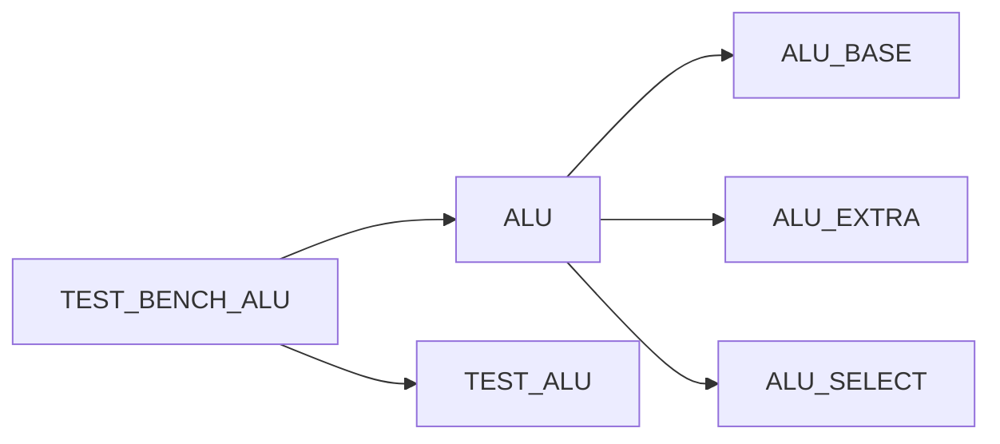

# ALU MODULE

There is an ALU module that consists of 2 different ALUs one which is the base and the other named extra.
The difference between the two is based on the RISCV standard bitfield FUNCT7, where a value of 0x0 means to choose the alu_base functionality given by the RISCV standard and the alu_extended which is given by a value of 0x20 from the bitfield FUNCT7.

# ALU_SELECT

ALU select has the responsibility to choose the ALU to use according to FUNCT7, the standard RISCV32i defines 2 values 0x0 and 0x20 which for the effect of this design will be named ALU_BASE and ALU_EXTRA respectively.

## ALU_BASE

ALU_BASE defines the following operations:
```
	parameter [2:0] ADD  = 3'h0;
	parameter [2:0] SLL  = 3'h1;
	parameter [2:0] SLT  = 3'h2;
	parameter [2:0] SLTU = 3'h3;
	parameter [2:0] XOR  = 3'h4;
	parameter [2:0] SRL  = 3'h5;
	parameter [2:0] OR   = 3'h6;
	parameter [2:0] AND  = 3'h7;
```

## ALU_EXTRA

ALU_EXTRA defines the following operations:
```
   parameter [2:0] SUB  = 3'h0; // bit select 31..25 = 32 -> means subtract
	parameter [2:0] SRA  = 3'h5; // bit select 31..25 = 32 -> means Shift Right Aritmethic which carries the MSB to the left
```

Notes: SRA is very useful operation when dealing with signed numbers  in order to preserve the sign after the shift

## ALU TEST 

There is an ALU top test that integrates the logic to select which ALU to use between the ALU_BASE and ALU_EXTRA.



